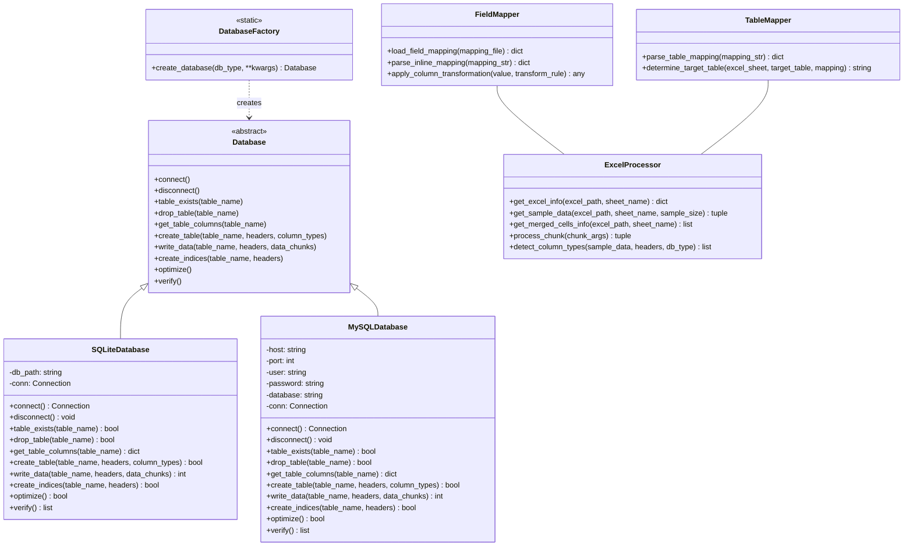

# XDB - 通用Excel/CSV到SQLite/MySQL转换工具

## 简介

XDB是一款高性能、多功能的Excel/CSV数据导入工具，支持将Excel(XLSX)文件或CSV文件快速转换为SQLite或MySQL数据库。通过并行处理和智能类型映射，它能够高效处理大型Excel和CSV文件，同时提供灵活的字段映射和数据转换功能。

## 主要特性

- **多种文件格式支持**：支持Excel (XLSX)和CSV文件格式
- **双数据库支持**：同时支持SQLite和MySQL作为目标数据库
- **高性能处理**：多进程并行处理，显著提升大文件处理速度
- **智能类型映射**：自动检测并优化字段类型，确保数据完整性
- **灵活导入模式**：
  - 覆盖模式（删除并重建表）
  - 追加模式（保留结构添加数据）
- **高级字段映射**：
  - 自动创建所有字段
  - 仅处理目标表已有字段
  - 自定义字段映射配置（支持重命名、过滤）
- **数据转换**：支持转换规则（大小写、日期格式化、文本替换等）
- **工作表处理**：支持处理单个或多个工作表（Excel）/ 自动检测CSV格式
- **自动索引创建**：基于智能规则自动创建索引提升查询性能
- **自定义表名**：支持指定目标数据库表名，覆盖默认的工作表名映射方式
- **CSV智能处理**：自动检测编码、分隔符、引号字符等CSV格式特征

## 设计原理

### 架构设计

XDB采用模块化设计，主要包含以下核心组件：

1. **数据库抽象层**：
   - 基于`Database`抽象基类
   - 分别实现`SQLiteDatabase`和`MySQLDatabase`具体类
   - 通过工厂模式创建相应数据库实例

2. **Excel处理引擎**：
   - 分块读取策略，避免内存溢出
   - 使用`pandas`和`openpyxl`高效处理Excel文件
   - 合并单元格自动处理

3. **并行处理框架**：
   - 基于`ProcessPoolExecutor`实现多进程处理
   - 智能分块机制，优化任务分配
   - 进度监控和显示

4. **类型检测与映射**：
   - 基于样本数据智能推断类型
   - 针对不同数据库定制类型映射策略
   - 主键自动检测和优化

5. **字段映射引擎**：
   - 多种映射配置方式（文件、内联）
   - 灵活的列转换规则
   - 错误处理和兼容性保障

6. **表名映射机制**：
   - 支持自定义目标表名
   - 支持源工作表到目标表的映射关系
   - 多优先级表名选择策略

### 项目架构图


### 类结构设计



### 数据处理流程


### 性能优化

1. **分块处理**：将大型Excel文件分成多个数据块并行处理
2. **内存管理**：动态垃圾回收和内存映射优化
3. **数据库优化**：根据目标数据库特性进行参数调整
4. **批量写入**：使用批处理方式提高写入效率
5. **智能索引**：根据列名特征自动创建高效索引
6. **NaN值处理**：自动识别并处理NaN值，确保数据库兼容性

## 安装与依赖

### 依赖项

```
pandas>=2.0.0
openpyxl>=3.1.0
tqdm>=4.60.0
pymysql>=1.0.0 (MySQL支持)
psutil>=5.9.0
```

### 安装方法

1. 克隆或下载代码：
```bash
git clone https://github.com/yourusername/xdb.git
cd xdb
```

2. 安装依赖：
```bash
pip install pandas openpyxl tqdm pymysql psutil
```

3. 确保脚本具有执行权限：
```bash
chmod +x XDB.py
```

## 基本用法

### 转换为SQLite数据库

Excel文件：
```bash
python XDB.py sample.xlsx --db-type sqlite --sqlite-path output.db
```

CSV文件：
```bash
python XDB.py data.csv --db-type sqlite --sqlite-path output.db
```

### 转换为MySQL数据库

Excel文件：
```bash
python XDB.py sample.xlsx --db-type mysql --mysql-database mydb --mysql-user root
```

CSV文件：
```bash
python XDB.py data.csv --db-type mysql --mysql-database mydb --mysql-user root
```

### 指定目标表名

```bash
python XDB.py sample.xlsx --db-type sqlite --sqlite-path output.db --target-table my_custom_table
```

### 查看Excel中的工作表

```bash
python XDB.py sample.xlsx --list-sheets
```

### 处理特定工作表

```bash
python XDB.py sample.xlsx --db-type sqlite --sqlite-path output.db --sheet "Sheet1"
```

### CSV文件特定选项

指定CSV编码和分隔符：
```bash
python XDB.py data.csv --db-type sqlite --sqlite-path output.db --csv-encoding utf-8 --csv-separator ";"
```

处理无表头的CSV文件：
```bash
python XDB.py data.csv --db-type sqlite --sqlite-path output.db --csv-no-header
```

## 高级用法

### 字段映射与转换

自定义字段映射（重命名列）：

Excel文件：
```bash
python XDB.py sales.xlsx --db-type sqlite --sqlite-path sales.db \
  --field-mode mapping \
  --mapping "销售表:产品编号=product_id,销售额=revenue,销售日期=sale_date"
```

CSV文件：
```bash
python XDB.py sales.csv --db-type sqlite --sqlite-path sales.db \
  --field-mode mapping \
  --mapping "Sheet1:产品编号=product_id,销售额=revenue,销售日期=sale_date"
```

使用映射文件：

```bash
python XDB.py sales.xlsx --db-type mysql --mysql-database sales \
  --field-mode mapping --mapping-file column_mapping.json
```

应用字段转换规则：

```bash
python XDB.py sales.xlsx --db-type sqlite --sqlite-path sales.db \
  --column-transform "销售表:产品编号:uppercase;销售表:销售日期:date_format:%Y-%m-%d"
```

### 表名映射与自定义

针对单个表指定目标表名：

```bash
python XDB.py customers.xlsx --db-type mysql --mysql-database crm \
  --target-table customer_master
```

多工作表到多目标表映射：

```bash
python XDB.py financial_data.xlsx --db-type mysql --mysql-database finance \
  --table-mapping "收入=income_data,支出=expense_data,资产=assets_data"
```

同时使用字段映射和表名映射：

```bash
python XDB.py sales.xlsx --db-type sqlite --sqlite-path sales.db \
  --field-mode mapping \
  --mapping "销售表:产品编号=product_id,销售额=revenue,销售日期=sale_date" \
  --table-mapping "销售表=product_sales"
```

### 追加数据到现有表

```bash
python XDB.py new_data.xlsx --db-type mysql --mysql-database mydb \
  --mode append --field-mode match-only
```

### 性能优化

调整工作进程数和块大小：

```bash
python XDB.py large_file.xlsx --db-type sqlite --sqlite-path output.db \
  --workers 8 --chunk-size 50000
```

## 命令行参数详解

### 基本参数

| 参数 | 描述 | 默认值 |
|------|------|--------|
| `file_path` | 输入文件路径 (Excel/CSV) | 必填 |
| `--db-type` | 数据库类型 (`sqlite` 或 `mysql`) | `sqlite` |
| `--sqlite-path` | SQLite数据库输出路径 | 使用SQLite时必填 |
| `--mysql-host` | MySQL主机地址 | `localhost` |
| `--mysql-port` | MySQL端口 | `3306` |
| `--mysql-user` | MySQL用户名 | `root` |
| `--mysql-password` | MySQL密码 (不提供则交互式输入) | - |
| `--mysql-database` | MySQL数据库名 | 使用MySQL时必填 |

### CSV文件参数

| 参数 | 描述 | 默认值 |
|------|------|--------|
| `--csv-encoding` | CSV文件编码 | 自动检测 |
| `--csv-separator` | CSV分隔符 | 自动检测 |
| `--csv-quotechar` | CSV引号字符 | `"` |
| `--csv-no-header` | CSV文件没有表头 | `False` |

### 操作模式参数

| 参数 | 描述 | 默认值 |
|------|------|--------|
| `--mode` | 操作模式 (`overwrite` 或 `append`) | `overwrite` |
| `--field-mode` | 字段处理模式 (`create-all`, `match-only`, 或 `mapping`) | `create-all` |
| `--mapping-file` | 字段映射配置文件路径(JSON或CSV格式) | - |
| `--mapping` | 内联字段映射配置 | - |
| `--column-transform` | 字段转换规则 | - |
| `--target-table` | 指定目标数据库表名（覆盖默认的工作表名） | - |
| `--table-mapping` | 工作表到数据库表的映射关系 | - |

### 优化和控制参数

| 参数 | 描述 | 默认值 |
|------|------|--------|
| `-w`, `--workers` | 工作进程数量 | CPU核心数-1 |
| `-c`, `--chunk-size` | 数据块大小 | `20000` |
| `-i`, `--max-indices` | 每个表创建的最大索引数量 | `3` |
| `-s`, `--sheet` | 仅处理指定的工作表 | 处理所有工作表 |
| `-l`, `--list-sheets` | 仅列出Excel中的工作表 | `False` |
| `-v`, `--verbose` | 启用详细日志 | `False` |
| `-q`, `--quiet` | 减少输出信息 | `False` |

## 映射配置详解

### 1. 内联字段映射格式

```
"工作表1:Excel列1=数据库列1,Excel列2=数据库列2;工作表2:Excel列3=数据库列3"
```

例如：
```
"销售表:产品编号=product_id,销售额=revenue;客户表:客户名=customer_name"
```

### 2. 表名映射格式

```
"工作表1=数据库表1,工作表2=数据库表2,工作表3=数据库表3"
```

例如：
```
"Sheet1=customer_data,Sheet2=order_data,Sheet3=product_data"
```

### 3. 映射文件格式

**JSON格式**：
```json
{
  "工作表1": {
    "Excel列1": "数据库列1",
    "Excel列2": "数据库列2"
  },
  "工作表2": {
    "Excel列3": "数据库列3"
  }
}
```

**CSV格式**：
```
工作表,Excel列,数据库列
工作表1,Excel列1,数据库列1
工作表1,Excel列2,数据库列2
工作表2,Excel列3,数据库列3
```

### 4. 字段转换规则

格式：`工作表:列名:规则`

支持的转换规则：
- `uppercase`：转为大写
- `lowercase`：转为小写
- `trim`：去除首尾空格
- `prefix:X`：添加前缀X
- `suffix:X`：添加后缀X
- `replace:old,new`：替换文本
- `date_format:格式`：日期格式化（如`%Y-%m-%d`）

例如：
```
"销售表:产品编号:uppercase;销售表:销售日期:date_format:%Y-%m-%d;销售表:客户编号:prefix:CUST-"
```

## 使用场景示例

### 场景1：数据迁移

将业务部门的Excel报表导入企业数据库：

```bash
python XDB.py 月度销售报表.xlsx --db-type mysql --mysql-database business_db \
  --mysql-user reports --field-mode mapping \
  --mapping-file sales_mapping.json --target-table sales_data
```

将CSV导出数据导入数据库：

```bash
python XDB.py export_data.csv --db-type mysql --mysql-database business_db \
  --mysql-user reports --csv-encoding utf-8 --target-table imported_data
```

### 场景2：数据整合与清理

处理并整合多个工作表的数据，同时进行数据清理：

```bash
python XDB.py 客户数据.xlsx --db-type sqlite --sqlite-path customers.db \
  --field-mode mapping --mapping "客户信息:客户ID=id,姓名=name,电话=phone" \
  --column-transform "客户信息:客户ID:uppercase;客户信息:电话:replace:+86,;客户信息:姓名:trim" \
  --table-mapping "客户信息=customer_master,订单信息=order_history"
```

### 场景3：定期数据更新

将新数据追加到现有数据库中：

```bash
python XDB.py 新销售数据.xlsx --db-type mysql --mysql-database sales_db \
  --mode append --field-mode match-only --target-table monthly_sales
```

追加CSV数据：

```bash
python XDB.py daily_sales.csv --db-type mysql --mysql-database sales_db \
  --mode append --field-mode match-only --target-table daily_sales
```

### 场景4：大文件处理

处理包含数百万行的大型文件：

Excel文件：
```bash
python XDB.py 大型数据集.xlsx --db-type sqlite --sqlite-path big_data.db \
  --workers 12 --chunk-size 100000 --target-table analytics_data
```

CSV文件：
```bash
python XDB.py large_dataset.csv --db-type sqlite --sqlite-path big_data.db \
  --workers 12 --chunk-size 100000 --csv-encoding utf-8 --target-table analytics_data
```

### 场景5：多表关联导入

将Excel文件中的多个工作表导入到不同的相关表：

```bash
python XDB.py 企业数据.xlsx --db-type mysql --mysql-database company_db \
  --table-mapping "员工=employees,部门=departments,项目=projects,薪资=salaries"
```

## 性能优化建议

1. **调整块大小**：
   - 小文件（<10万行）：默认块大小（20000）通常足够
   - 中型文件（10-100万行）：建议块大小增加到50000-100000
   - 大型文件（>100万行）：可以使用100000或更大块大小

2. **工作进程数量**：
   - 一般建议：设置为CPU核心数-1
   - 内存受限系统：减少工作进程数（2-4个）
   - 高性能服务器：可以增加到CPU核心数或更多

3. **数据库选择**：
   - 单用户，本地处理：SQLite性能更佳
   - 多用户，网络访问：MySQL更适合

4. **索引策略**：
   - 频繁查询：增加`--max-indices`参数（5-8）
   - 以写入为主：减少索引数量（1-2）或完全禁用（0）

5. **内存优化**：
   - 处理前关闭内存密集型应用
   - 对于极大文件，考虑先拆分Excel

6. **NaN值与特殊值处理**：
   - 程序会自动处理NaN值转换为NULL
   - 对于特殊的空值处理需求，可以通过字段转换规则实现

## 常见问题与解决方案

**问题**：处理大文件时内存错误  
**解决方案**：减少工作进程数，增加块大小，或拆分Excel文件

**问题**：字段类型检测不准确  
**解决方案**：使用映射模式并在目标数据库中预先创建正确类型的表

**问题**：MySQL连接错误  
**解决方案**：检查用户名/密码，确保用户有足够权限，并检查网络连接

**问题**：处理速度过慢  
**解决方案**：调整工作进程数和块大小，减少不必要的索引

**问题**：字段映射不生效  
**解决方案**：检查映射语法，确保使用了`--field-mode mapping`参数

**问题**：表名映射不生效  
**解决方案**：检查表名映射语法，确保格式为`工作表名=数据库表名`

**问题**：--list-sheets选项对CSV文件不工作  
**解决方案**：--list-sheets选项仅适用于Excel文件，CSV文件只有一个默认工作表"Sheet1"

**问题**：CSV文件字段映射语法  
**解决方案**：CSV文件的字段映射应使用"Sheet1"作为工作表名，如：`--mapping "Sheet1:原列名=新列名"`

**问题**：MySQL导入出现NaN错误  
**解决方案**：最新版本已自动处理NaN值转换为NULL，无需手动干预

**问题**：如何处理含有特殊字符的表名  
**解决方案**：使用`--target-table`或`--table-mapping`指定合法的表名

## 表名映射策略说明

XDB使用以下优先级确定目标表名：

1. **表映射参数（--table-mapping）**：如果提供了`--table-mapping`参数，并且当前处理的工作表在映射中存在，则使用映射指定的表名
2. **目标表参数（--target-table）**：如果提供了`--target-table`参数，且当前处理的是唯一工作表或指定的工作表，则使用此表名
3. **默认行为**：使用工作表名作为数据库表名（会自动规范化不符合数据库命名规则的字符）

这种多级策略确保了最大的灵活性，既可以处理单个工作表到单个表的简单情况，也可以处理复杂的多表映射关系。
